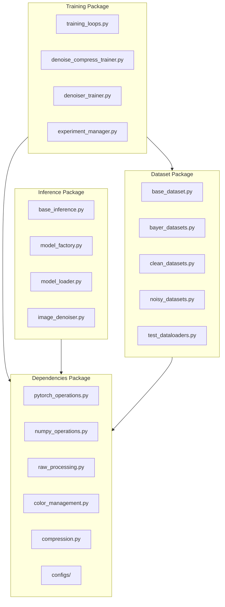

# RawNIND: Learning Joint Denoising, Demosaicing, and Compression

This repository contains the source code for the research paper "Learning Joint Denoising, Demosaicing, and Compression from the Raw Natural Image Noise Dataset". The codebase has been refactored from its original monolithic structure into a modular, maintainable architecture.

## Project Overview

RawNIND implements deep learning models for joint image denoising, demosaicing, and compression. The system processes RAW camera images through neural networks trained on the RawNIND dataset, which contains paired noisy/clean images captured under various conditions.

Key features:
- Joint denoising and compression models
- Support for multiple camera Bayer patterns (RGGB, GBRG, BGGR, GRBG)
- End-to-end processing from RAW to compressed output
- Modular architecture for extensibility

## Architecture

The codebase is organized into four main packages:



## Installation

### Requirements

- Python 3.8+
- PyTorch 1.10+ (CUDA or CPU)
- CUDA 11.1+ (for GPU acceleration)

### Dependencies

Install core dependencies:

```bash
pip install torch torchvision torchaudio --index-url https://download.pytorch.org/whl/cu121
pip install colour-science pytorch-msssim ConfigArgParse rawpy imageio
pip install opencv-python numpy scipy matplotlib tqdm
```

For RAW processing support:

```bash
pip install rawpy colour-science
```

For OpenEXR support:

```bash
pip install OpenEXR
# Or on some systems:
pip install https://github.com/jamesbowman/openexrpython/archive/master.zip
```

### Dataset Setup

Download the RawNIND dataset:

```bash
# Download from Dataverse
curl -s "https://dataverse.uclouvain.be/api/datasets/:persistentId/?persistentId=doi:10.14428/DVN/DEQCIM" | \
jq -r '.data.latestVersion.files[] | "wget -c -O \"\(.dataFile.filename)\" https://dataverse.uclouvain.be/api/access/datafile/\(.dataFile.id)"' | \
bash
```

Prepare the dataset:

```bash
cd src/rawnind

# Pre-crop images for training
python tools/crop_datasets.py --dataset rawnind

# Compute image alignment and create masks
python tools/prep_image_dataset.py
```

## Usage

### Training

Train a joint denoising+compression model:

```bash
cd src/rawnind
python training/train_dc_bayer2prgb.py --config dependencies/configs/train_dc_bayer2prgb.yaml
```

Train a denoising-only model:

```bash
python training/train_denoiser_bayer2prgb.py --config dependencies/configs/train_denoise_bayer2prgb.yaml
```

### Inference

Process images with a trained model:

```bash
cd src/rawnind
python tools/denoise_image.py --config dependencies/configs/test_reserve.yaml --load_path models/rawnind_dc/expname/
```

### Testing

Run the test suite:

```bash
# Run all tests
python -m pytest src/rawnind/tests/

# Run specific package tests
python -m pytest src/rawnind/inference/tests/
python -m pytest src/rawnind/training/tests/
python -m pytest src/rawnind/dataset/tests/
python -m pytest src/rawnind/dependencies/tests/
```

## Project Structure

```
src/rawnind/
├── dependencies/          # Core utilities and shared code
│   ├── configs/          # Configuration files
│   ├── raw_processing.py # RAW image processing
│   ├── pytorch_helpers.py # PyTorch utilities
│   └── ...
├── training/             # Training infrastructure
│   ├── training_loops.py # Core training logic
│   ├── train_*.py       # Training entry points
│   └── experiment_manager.py
├── inference/            # Model inference and deployment
│   ├── model_factory.py # Model creation and loading
│   ├── image_denoiser.py # Inference utilities
│   └── ...
├── dataset/              # Dataset handling and preprocessing
│   ├── base_dataset.py  # Base dataset classes
│   ├── bayer_datasets.py # Bayer-specific datasets
│   └── ...
├── models/               # Neural network architectures
├── tests/                # Test suite
│   ├── acceptance/      # Integration tests
│   └── conftest.py      # Test configuration
└── tools/                # Utility scripts
```

### Downloading the RawNIND Dataset

If you just want to download the RawNIND dataset, you can use the following command:

```bash
curl -s "https://dataverse.uclouvain.be/api/datasets/:persistentId/?persistentId=doi:10.14428/DVN/DEQCIM" | jq -r '.data.latestVersion.files[] | "wget -c -O \"\(.dataFile.filename)\" https://dataverse.uclouvain.be/api/access/datafile/\(.dataFile.id)"' | bash
```

### Pre-trained models

Pre-trained models are available through the following link: https://drive.google.com/drive/folders/12Uc5sT4OWx02sviUS_boDk1zDSDRVorw?usp=sharing

### Citation

You can cite the "Learning Joint Denoising, Demosaicing, and Compression from the Raw Natural Image Noise Dataset" paper as follows:

```bibtex
@misc{brummer2025learningjointdenoisingdemosaicing,
	  title={Learning Joint Denoising, Demosaicing, and Compression from the Raw Natural Image Noise Dataset},
	  author={Benoit Brummer and Christophe De Vleeschouwer},
	  year={2025},
	  eprint={2501.08924},
	  archivePrefix={arXiv},
	  primaryClass={cs.CV},
	  url={https://arxiv.org/abs/2501.08924},
}
```
