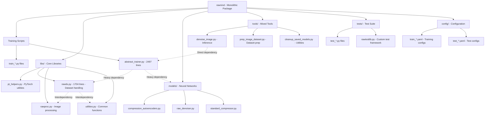
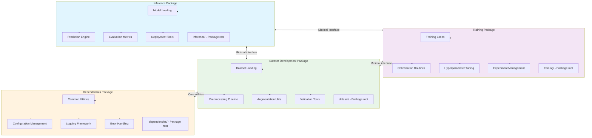

Based on my comprehensive analysis of the codebase, I have completed the examination and created the requested Mermaid
diagrams. Here are the results:

## Current Codebase Structure Analysis

The current codebase is a monolithic PyTorch-based repository with significant structural issues:

### Key Findings:

1. **Monolithic Architecture**: All functionality is contained within a single `src/rawnind/` package
2. **Large Files**: Critical files like `abstract_trainer.py` (2497 lines) and `rawds.py` (1704 lines) are too large
3. **Tight Coupling**: Heavy interdependencies between training, inference, and dataset components
4. **Mixed Responsibilities**: Training scripts, inference tools, and utility tools are all mixed together
5. **Configuration Scattered**: YAML config files are mixed with training scripts

### Current Structure Issues:

- **Training/Inference Mixed**: The `abstract_trainer.py` handles both training loops and inference
- **Dataset Logic Embedded**: Dataset handling is tightly coupled with training logic
- **Tools Unorganized**: Both inference tools and utility scripts in the same directory
- **Tests Partially Migrated**: Test suite is only partially migrated to pytest with missing coverage

## Mermaid Diagrams

### Current Monolithic Structure

### Proposed Partitioned Structure

## Proposed Refactoring Plan

### 1. **Inference Package** (`src/rawnind/inference/`)

- Extract inference logic from `abstract_trainer.py`
- Move model loading and prediction functionality
- Include evaluation and deployment tools
- **Source**: `tools/denoise_image.py`, `tools/simple_denoiser.py`

### 2. **Training Package** (`src/rawnind/training/`)

- Extract training loops and optimization from `abstract_trainer.py`
- Move hyperparameter tuning and experiment management
- Include research and development scripts
- **Source**: `abstract_trainer.py` training components, `train_*.py` files

### 3. **Dataset Development Package** (`src/rawnind/dataset/`)

- Extract all dataset handling logic from `rawds.py`
- Move preprocessing and augmentation utilities
- Include validation and data handling tools
- **Source**: `libs/rawds.py`, `tools/prep_image_dataset*.py`, `tools/crop_datasets.py`

### 4. **Dependencies Package** (`src/rawnind/dependencies/`)

- Consolidate shared utilities and configurations
- Move logging, error handling, and common functions
- Include all configuration files
- **Source**: `libs/utilities.py`, `libs/pt_helpers.py`, `config/` directory, `libs/json_saver.py`

## Key Benefits of This Refactoring:

1. **Modularity**: Each package has a single, well-defined responsibility
2. **Reduced Coupling**: Minimal inter-package dependencies through clean interfaces
3. **Improved Testability**: Each package can be tested independently
4. **Better Maintainability**: Smaller, focused packages are easier to maintain
5. **Enhanced Reusability**: Components can be reused across different contexts
6. **Clearer Dependencies**: Explicit package boundaries make dependencies visible

## Migration Strategy:

1. **Phase 1**: Create new package structure alongside existing code
2. **Phase 2**: Extract and move components incrementally
3. **Phase 3**: Update imports and dependencies
4. **Phase 4**: Remove old monolithic structure
5. **Phase 5**: Update tests and documentation

This refactoring will transform the current monolithic structure into a well-organized, modular architecture that
promotes maintainability, testability, and reusability while preserving all existing functionality.

Are you satisfied with this analysis and proposed structure, or would you like me to make any adjustments to the plan?

---

Perfect! Here's a detailed breakdown of which classes and functions from the current monorepo would be moved to each
proposed package:

## 1. **Inference Package** (`src/rawnind/inference/`)

### Current Location → New Package Mapping:

**From `libs/abstract_trainer.py`:**

- `ImageToImageNN.load_model()` → `model_loader.py`
- `ImageToImageNN.infer()` → `inference_engine.py`
- `ImageToImageNN.get_best_step()` → `model_loader.py`
- `ImageToImageNN.get_transfer_function()` → `inference_engine.py`
- `get_and_load_test_object()` → `model_factory.py`
- `get_and_load_model()` → `model_factory.py`

**From `tools/`:**

- `denoise_image.py` (entire file) → `image_denoiser.py`
- `simple_denoiser.py` (entire file) → `simple_denoiser.py`
- `test_all_known.py` → `batch_inference.py`

**From `models/`:**

- All model classes → `models/` subdirectory
- `bitEstimator.py` → `models/bit_estimator.py`
- `bm3d_denoiser.py` → `models/bm3d_denoiser.py`
- `compression_autoencoders.py` → `models/compression_autoencoders.py`
- `denoise_then_compress.py` → `models/denoise_then_compress.py`
- `manynets_compression.py` → `models/manynets_compression.py`
- `raw_denoiser.py` → `models/raw_denoiser.py`
- `standard_compressor.py` → `models/standard_compressor.py`

## 2. **Training Package** (`src/rawnind/training/`)

### Current Location → New Package Mapping:

**From `libs/abstract_trainer.py`:**

- `ImageToImageNNTraining` class → `training_loops.py`
- `PRGBImageToImageNNTraining` class → `training_loops.py`
- `BayerImageToImageNNTraining` class → `training_loops.py`
- `DenoiseCompressTraining` class → `training_loops.py`
- `DenoiserTraining` class → `training_loops.py`
- `ImageToImageNNTraining.training_loop()` → `training_loops.py`
- `ImageToImageNNTraining.validate_or_test()` → `training_loops.py`
- `ImageToImageNNTraining.get_dataloaders()` → `training_loops.py`
- `ImageToImageNNTraining.step()` → `training_loops.py`
- `ImageToImageNNTraining.compute_train_loss()` → `training_loops.py`

**From root training scripts:**

- `train_dc_bayer2prgb.py` (entire file) → `denoise_compress_trainer.py`
- `train_dc_prgb2prgb.py` (entire file) → `denoise_compress_trainer.py`
- `train_denoiser_bayer2prgb.py` (entire file) → `denoiser_trainer.py`
- `train_denoiser_prgb2prgb.py` (entire file) → `denoiser_trainer.py`

**From `tools/`:**

- `find_best_expname_iteration.py` → `experiment_manager.py`
- `cleanup_saved_models_iterations.py` → `experiment_manager.py`
- `cleanup_saved_models_unused_test_images.py` → `experiment_manager.py`
- `rm_empty_models.py` → `experiment_manager.py`
- `rm_nonbest_model_iterations.py` → `experiment_manager.py`

## 3. **Dataset Development Package** (`src/rawnind/dataset/`)

### Current Location → New Package Mapping:

**From `libs/rawds.py`:**

- `RawImageDataset` class → `base_dataset.py`
- `ProfiledRGBBayerImageDataset` class → `bayer_datasets.py`
- `ProfiledRGBProfiledRGBImageDataset` class → `rgb_datasets.py`
- `CleanCleanImageDataset` class → `clean_datasets.py`
- `CleanNoisyDataset` class → `noisy_datasets.py`
- `TestDataLoader` class → `test_dataloaders.py`
- All dataset classes (1704 lines total) → Split across multiple files

**From `tools/`:**

- `prep_image_dataset.py` → `dataset_preparation.py`
- `prep_image_dataset_extraraw.py` → `dataset_preparation.py`
- `crop_datasets.py` → `dataset_preparation.py`
- `gather_raw_gt_images.py` → `dataset_preparation.py`
- `check_dataset.py` → `dataset_validation.py`
- `summarize_dataset.py` → `dataset_validation.py`
- `add_msssim_score_to_dataset_yaml_descriptor.py` → `dataset_validation.py`

**From `libs/`:**

- `rawds_ext_paired_test.py` → `extended_datasets.py`
- `rawds_manproc.py` → `manual_processing.py`

## 4. **Dependencies Package** (`src/rawnind/dependencies/`)

### Current Location → New Package Mapping:

**From `libs/`:**

- `pt_helpers.py` (entire file) → `pytorch_helpers.py`
- `utilities.py` (entire file) → `utilities.py`
- `json_saver.py` (entire file) → `json_saver.py`
- `locking.py` (entire file) → `locking.py`
- `pt_losses.py` (entire file) → `pytorch_losses.py`
- `pt_ops.py` (entire file) → `pytorch_operations.py`
- `np_imgops.py` (entire file) → `numpy_operations.py`
- `raw.py` (entire file) → `raw_processing.py`
- `rawproc.py` (entire file) → `raw_processing.py`
- `icc.py` (entire file) → `color_management.py`
- `arbitrary_proc_fun.py` (entire file) → `arbitrary_processing.py`
- `stdcompression.py` (entire file) → `compression.py`
- `libimganalysis.py` (entire file) → `image_analysis.py`

**From `config/`:**

- All YAML configuration files → `configs/` subdirectory
- `train_*.yaml` files → `configs/training_configs.py`
- `test_*.yaml` files → `configs/test_configs.py`
- `graph_*.yaml` files → `configs/model_configs.py`

**From `common/extlibs/`:**

- `gdn.py` → `external_libraries.py`

## 5. **Test Suite Reorganization**

### Current Location → New Package Mapping:

**From `tests/`:**

- `test_pytorch_integration.py` → `inference/tests/test_pytorch_integration.py`
- `test_bm3d_denoiser.py` → `inference/tests/test_bm3d_denoiser.py`
- `test_standard_compressor.py` → `inference/tests/test_standard_compressor.py`
- `test_ext_raw_denoise.py` → `inference/tests/test_ext_raw_denoise.py`

- `test_datasets_load_time.py` → `dataset/tests/test_datasets_load_time.py`
- `test_manproc.py` → `dataset/tests/test_manproc.py`
- `test_validation.py` → `dataset/tests/test_validation.py`

- `test_alignment.py` → `training/tests/test_alignment.py`
- `test_progressive_rawnind.py` → `training/tests/test_progressive_rawnind.py`
- `test_validate_and_test.py` → `training/tests/test_validate_and_test.py`

**From `libs/`:**

- `rawtestlib.py` → `dependencies/testing_utils.py`

## Key Refactoring Notes:

1. **Large File Splitting**:
    - `abstract_trainer.py` (2497 lines) → Split into training and inference components
    - `rawds.py` (1704 lines) → Split into multiple dataset-specific files

2. **Dependency Minimization**:
    - Each package will have minimal dependencies on others
    - Clean interfaces will be created for cross-package communication
    - Shared utilities moved to dependencies package

3. **Configuration Consolidation**:
    - All config files moved to dependencies package
    - Configuration loading utilities will be centralized

4. **Test Organization**:
    - Tests reorganized to match new package structure
    - Each package will have its own test directory

This detailed mapping shows exactly how each component will be reorganized, making the refactoring process clear and
actionable. Each item shows both the current location and the proposed new location in the modular structure.