### Function-Based Composable Pipeline Architecture - UML Diagram

```mermaid
classDiagram
    %% Core Architecture
    class PipelineOperation {
        <<abstract>>
        +spec: OperationSpec
        +metadata_cache: Dict
        +process_tensors(data, metadata, **kwargs)*
        +validate_inputs(inputs, metadata)
        +__call__(data, metadata, **kwargs)
    }

    class OperationSpec {
        +name: str
        +supported_modes: List[ProcessingMode]
        +input_types: List[InputOutputType]
        +output_types: List[InputOutputType]
        +input_count: Tuple[int, Optional[int]]
        +output_count: int
        +requires_metadata: List[str]
        +produces_metadata: List[str]
        +constraints: Dict[str, Any]
        +description: str
    }

    class ProcessingMode {
        <<enumeration>>
        SINGLE_IMAGE
        BURST_PROCESSING
        BATCH_PROCESSING
        GROUP_PROCESSING
    }

    class InputOutputType {
        <<enumeration>>
        RAW_BAYER
        RAW_4CH
        RGB
        LAB
        GRAYSCALE
        MULTI_EXPOSURE
        MASK
        METADATA
    }

    %% Operation Pipeline System
    class OperationPipeline {
        +operations: List[PipelineOperation]
        +metadata_history: List[Dict]
        +execution_plan: Dict[str, Any]
        +__init__(config)
        +__call__(data, metadata)
        +get_trainable_operations()
        +execute_optimized(data, metadata)
    }

    class SmartPipelineAssembler {
        +registry: Dict
        +validate_pipeline_compatibility(config)
        +suggest_missing_operations(input_type, target_type)
        +_get_operation_spec(op_config)
        +_generate_auto_fixes(warnings, config)
    }

    class MetadataDependencyResolver {
        +operations: List[OperationSpec]
        +dependency_graph: Dict
        +validate_pipeline(initial_metadata)
        +_suggest_providers(missing_metadata)
        +_build_dependency_graph()
    }

    %% Registry System
    class ComprehensiveOperationRegistry {
        <<singleton>>
        +raw_processing_operations: Dict
        +color_processing_operations: Dict
        +tone_mapping_operations: Dict
        +enhancement_operations: Dict
        +geometric_operations: Dict
        +denoising_operations: Dict
        +burst_processing_operations: Dict
        +quality_assessment_operations: Dict
        +creative_operations: Dict
        +get_operation(category, name)
        +list_categories()
        +validate_operation_exists(category, name)
    }

    %% Kornia Integration
    class KorniaOperationRegistry {
        <<singleton>>
        +kornia_filter_operations: Dict
        +kornia_color_operations: Dict
        +kornia_enhance_operations: Dict
        +kornia_geometry_operations: Dict
        +kornia_camera_operations: Dict
        +kornia_augmentation_operations: Dict
        +kornia_loss_operations: Dict
        +kornia_metrics_operations: Dict
        +kornia_feature_operations: Dict
        +create_kornia_wrapper(operation_name, kornia_fn)
    }

    class KorniaOperationWrapper {
        +kornia_function: Callable
        +__init__(kornia_fn, spec)
        +process_tensors(data, metadata, **kwargs)
        +_convert_to_kornia_format(tensor)
        +_convert_from_kornia_format(tensor)
    }

    %% Registry Pattern Extensions
    class ModelRegistry {
        <<singleton>>
        +models: Dict[str, Type]
        +utnet2: UTNet2Wrapper
        +utnet3: UTNet3Wrapper
        +bm3d: BM3DWrapper
        +learned_denoise: LearnedDenoiseNet
        +get_model(name, **params)
        +register_model(name, model_class)
    }

    class QualityChecksRegistry {
        <<singleton>>
        +checks: Dict[str, Callable]
        +overexposure: OverexposureCheckWrapper
        +noise_estimation: NoiseEstimationWrapper
        +blur_detection: BlurDetectionWrapper
        +exposure_analysis: ExposureAnalysisWrapper
        +create_quality_pipeline(config)
    }

    class PreprocessingRegistry {
        <<singleton>>
        +steps: Dict[str, Callable]
        +normalize: NormalizeWrapper
        +gamma_correction: GammaCorrectionWrapper
        +white_balance: WhiteBalanceWrapper
        +demosaic: DemosaicWrapper
        +create_preprocessing_pipeline(config)
    }

    class TrainingStrategyRegistry {
        <<singleton>>
        +strategies: Dict[str, Type]
        +supervised: SupervisedTrainingStrategy
        +self_supervised: SelfSupervisedStrategy
        +adversarial: AdversarialTrainingStrategy
        +multi_task: MultiTaskTrainingStrategy
        +create_strategy(name, operations)
    }

    %% PyTorch Lightning Integration
    class ImageProcessingTask {
        <<LightningModule>>
        +pipeline: OperationPipeline
        +loss_functions: List[Tuple]
        +training_step(batch, batch_idx)
        +validation_step(batch, batch_idx)
        +configure_optimizers()
        +_compute_adaptive_loss(outputs, targets, metadata)
    }

    class AdaptiveOperationTrainer {
        +operation: PipelineOperation
        +batch_strategy: str
        +loss_strategy: str
        +_determine_batch_strategy()
        +_create_training_batch(dataset_batch)
        +_compute_adaptive_loss(outputs, targets, metadata)
    }

    %% Hydra Configuration System
    class LayeredConfigurationSystem {
        +registry: Dict
        +operation_resolver: OperationResolver
        +resolve_simple_config(simple_config)
        +validate_and_suggest(config)
        +_generate_suggestion(warning, config)
        +_generate_auto_fixes(warnings, config)
    }

    class HydraPipelineFactory {
        +create_pipeline_from_config(config_name, overrides)
        +_initialize_config_store()
        +_compose_configuration(config_name, overrides)
    }

    %% Specific Operation Implementations
    class UTNet2Wrapper {
        +model: UTNet2
        +operation_type: "trainable"
        +process_tensors(inputs, metadata, **kwargs)
        +get_parameters()
    }

    class BilateralWrapper {
        +sigma_color: float
        +sigma_space: float
        +operation_type: "non_trainable"
        +process_tensors(inputs, metadata, **kwargs)
    }

    class HDRMergeWrapper {
        +alignment_method: str
        +merge_algorithm: str
        +input_count: (3, None)
        +output_count: 1
        +process_tensors(inputs, metadata, **kwargs)
        +_align_images(images)
        +_merge_exposures(aligned_images, metadata)
    }

    %% Production Features
    class OptimizedPipelineExecutor {
        +operations: List[PipelineOperation]
        +execution_plan: Dict[str, Any]
        +_create_execution_plan()
        +execute_optimized(data, metadata)
        +_execute_batched_group(group, data, metadata)
        +_execute_with_memory_management(operation, data, metadata)
    }

    class PipelineDebugger {
        +trace_execution(pipeline, data)
        +_save_operation_visualization(name, output)
        +_analyze_pipeline_performance(pipeline, data)
    }

    %% Lightning Callbacks
    class PipelineVisualizationCallback {
        <<Callback>>
        +on_validation_epoch_end(trainer, pl_module)
        +_save_visualization(name, output)
    }

    class QualityMetricsCallback {
        <<Callback>>
        +on_train_batch_end(trainer, pl_module, outputs, batch, batch_idx)
        +_extract_metrics_from_metadata(metadata)
    }

    %% Relationships
    PipelineOperation --> OperationSpec : has
    OperationSpec --> ProcessingMode : uses
    OperationSpec --> InputOutputType : uses
    
    OperationPipeline --> PipelineOperation : contains
    OperationPipeline --> SmartPipelineAssembler : validated_by
    OperationPipeline --> MetadataDependencyResolver : analyzed_by
    
    SmartPipelineAssembler --> ComprehensiveOperationRegistry : uses
    SmartPipelineAssembler --> KorniaOperationRegistry : uses
    
    ComprehensiveOperationRegistry --> UTNet2Wrapper : contains
    ComprehensiveOperationRegistry --> BilateralWrapper : contains  
    ComprehensiveOperationRegistry --> HDRMergeWrapper : contains
    
    KorniaOperationRegistry --> KorniaOperationWrapper : creates
    
    ModelRegistry --> UTNet2Wrapper : provides
    QualityChecksRegistry --> PipelineOperation : creates
    PreprocessingRegistry --> PipelineOperation : creates
    TrainingStrategyRegistry --> AdaptiveOperationTrainer : creates
    
    ImageProcessingTask --> OperationPipeline : uses
    ImageProcessingTask --> PipelineVisualizationCallback : monitored_by
    ImageProcessingTask --> QualityMetricsCallback : monitored_by
    
    LayeredConfigurationSystem --> HydraPipelineFactory : used_by
    HydraPipelineFactory --> ImageProcessingTask : creates
    HydraPipelineFactory --> OperationPipeline : creates
    
    OptimizedPipelineExecutor --> OperationPipeline : optimizes
    PipelineDebugger --> OperationPipeline : debugs
    
    %% Inheritance
    UTNet2Wrapper --|> PipelineOperation
    BilateralWrapper --|> PipelineOperation  
    HDRMergeWrapper --|> PipelineOperation
    KorniaOperationWrapper --|> PipelineOperation
    ImageProcessingTask --|> LightningModule
    PipelineVisualizationCallback --|> Callback
    QualityMetricsCallback --|> Callback
```

### ### Architecture Overview

This UML diagram represents the complete Function-Based Composable Pipeline Architecture with the following key
components:

#### **Core Architecture (Purple Section)**

- **`PipelineOperation`**: Universal abstract base class for all operations
- **`OperationSpec`**: Comprehensive specification defining operation characteristics
- **`OperationPipeline`**: Main pipeline executor that chains operations
- **`SmartPipelineAssembler`**: Validates pipeline compatibility and suggests fixes

#### **Registry System (Green Section)**

- **`ComprehensiveOperationRegistry`**: Master registry containing 45+ operations across 9 categories
- **`KorniaOperationRegistry`**: Specialized registry for 65+ Kornia computer vision operations
- **Extension Registries**: Model, Quality Checks, Preprocessing, and Training Strategy registries

#### **Framework Integration (Blue Section)**

- **PyTorch Lightning Integration**: `ImageProcessingTask` and callbacks for professional ML workflows
- **Hydra Configuration**: `LayeredConfigurationSystem` and factory for experiment management
- **Adaptive Training**: Specialized trainers that adapt to operation characteristics

#### **Production Features (Orange Section)**

- **`OptimizedPipelineExecutor`**: Performance-optimized execution with batching and memory management
- **`PipelineDebugger`**: Comprehensive debugging and introspection tools
- **Monitoring Callbacks**: Visualization and quality metrics tracking

#### **Operation Implementations (Yellow Section)**

- **Classical Operations**: Like `BilateralWrapper` for traditional algorithms
- **ML Operations**: Like `UTNet2Wrapper` for trainable neural networks
- **Multi-Image Operations**: Like `HDRMergeWrapper` for burst processing
- **Kornia Wrappers**: GPU-accelerated computer vision operations

### ### Key Architectural Principles

#### **1. Universal Interface**

All operations conform to the same `PipelineOperation` interface, enabling seamless composition regardless of
implementation (classical, ML, or Kornia-based).

#### **2. Function-Based Organization**

Operations are grouped by **intended function** (denoising, enhancement, etc.) rather than implementation details,
maintaining the core philosophy.

#### **3. Smart Validation**

The system automatically validates pipeline compatibility, suggests missing operations, and provides intelligent error
handling.

#### **4. Production-Ready Features**

Includes professional ML development tools (Lightning), experiment management (Hydra), performance optimization, and
comprehensive monitoring.

#### **5. Extensibility**

New operations can be added to any registry without modifying core architecture, and the system automatically handles
validation and integration.

### ### Data Flow

1. **Configuration** → Hydra parses YAML configs and creates pipeline specifications
2. **Assembly** → Smart assembler validates compatibility and creates operation sequence
3. **Execution** → Pipeline executor runs operations with optimizations and monitoring
4. **Training** → Lightning integration enables professional ML training workflows
5. **Quality** → Built-in quality assessment and debugging throughout the pipeline

This architecture successfully transforms the elegant augmentations pipeline concept into a comprehensive,
production-ready system that handles everything from basic image processing to advanced multi-image workflows while
maintaining the core principle: **the pipeline doesn't care about implementation details, only functional intent**.