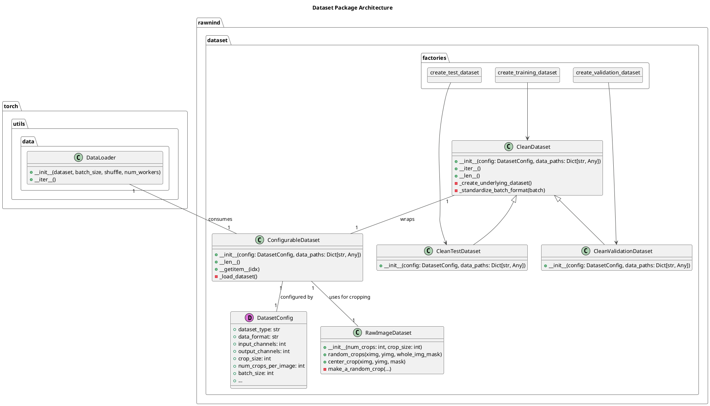
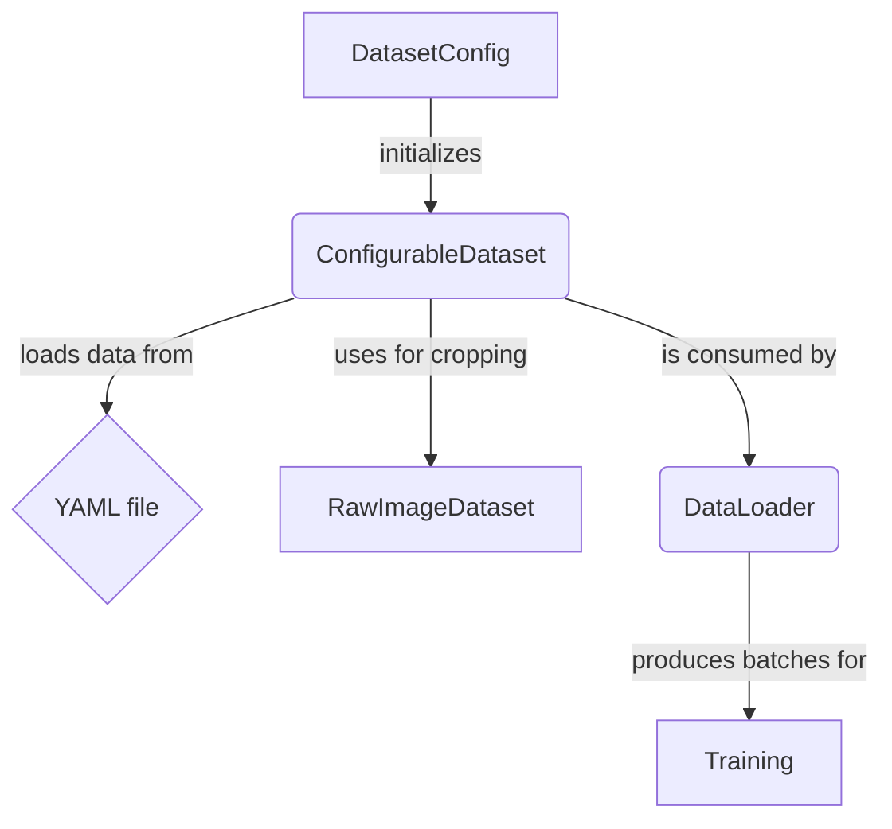

# `rawnind.dataset`

The `rawnind.dataset` package is responsible for all data loading and preprocessing in the RawNIND project. It provides a clean, high-level API for creating and managing datasets, encapsulating the complexity of file handling, data augmentation, and batching.

## Architecture

The `dataset` package is designed around a unified, configuration-driven architecture. The central component is the `ConfigurableDataset` class, which is a standard `torch.utils.data.Dataset` that is configured by a `DatasetConfig` dataclass. This design pattern ensures that all dataset configuration is centralized and explicit, making it easy to create and reproduce datasets with different configurations.

The `ConfigurableDataset` uses the `RawImageDataset` class to perform cropping and data augmentation. The `RawImageDataset` class is a simple, flexible class that can be used to perform a variety of common image transformations.

The `ConfigurableDataset` is consumed by a standard PyTorch `DataLoader`, which provides an efficient, parallelized data loading pipeline.

## Data Flow

The data flow in the `dataset` package is as follows:

1.  A `DatasetConfig` dataclass is created to specify the desired dataset configuration.
2.  The `DatasetConfig` is used to initialize a `ConfigurableDataset`.
3.  The `ConfigurableDataset` loads a dataset from a YAML file.
4.  The `ConfigurableDataset` uses a `RawImageDataset` to perform cropping and data augmentation.
5.  The `ConfigurableDataset` is consumed by a `DataLoader`, which produces batches of data for training.

## API

The `dataset` package exposes a simple, high-level API for creating and managing datasets. The primary entry points are the `create_training_dataset`, `create_validation_dataset`, and `create_test_dataset` factory functions. These functions take a `DatasetConfig` dataclass as input and return a `CleanDataset`, `CleanValidationDataset`, or `CleanTestDataset` instance, respectively.

The `CleanDataset`, `CleanValidationDataset`, and `CleanTestDataset` classes are all subclasses of `torch.utils.data.Dataset` and can be used with a standard PyTorch `DataLoader`.

## Domain Knowledge

The `dataset` package is designed to work with raw image data from a variety of sources. The `RawImageDataset` class is capable of handling both Bayer and RGB images, and it can perform a variety of common image transformations, including:

*   Cropping
*   Flipping
*   Rotating
*   Color space conversion
*   Demosaicing

The `ConfigurableDataset` class is designed to be easily extensible, and it can be used to create datasets from a variety of different data sources.